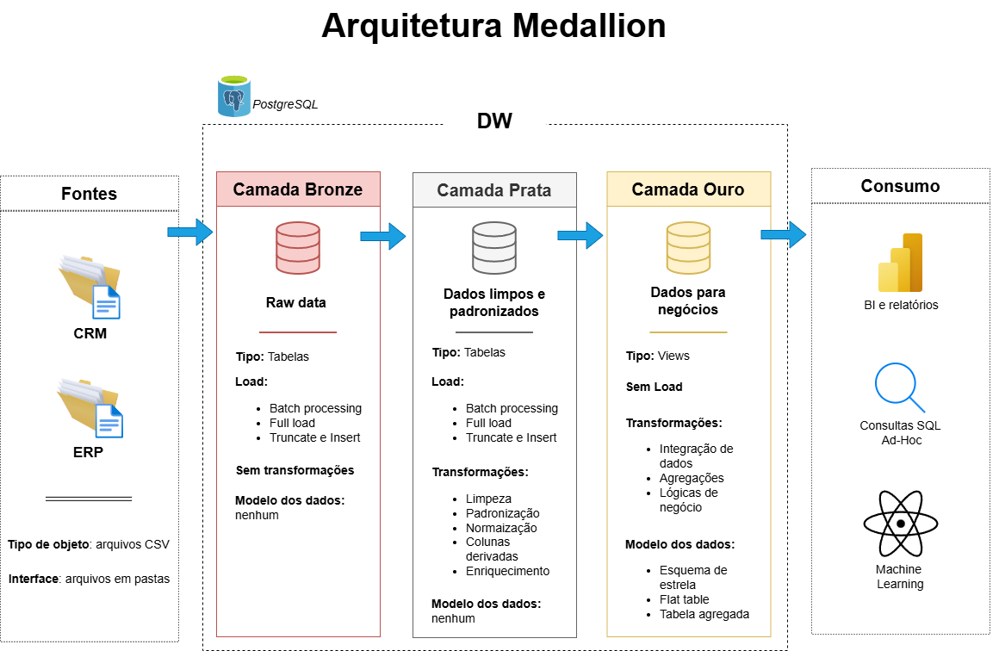

# Medallion Data Warehouse 

Bem-vindo ao repositório do projeto de **Medallion Data Warehouse**. Aqui, você encontra a construção de um Data Warehouse utilizando arquitetura medallion, com foco em modelagem dimensional, qualidade de dados e suporte a análises. 

A implementação segue boas práticas de Data Engineering, organização de pipelines ETL e padronização de nomenclatura.

🇺🇸 English version available here: [README_EN.md](README_EN.md)

---

## 🏗️ Arquitetura de Dados

A arquitetura adotada segue o padrão **Medallion**, organizada em três camadas:

### Bronze 
Armazena os dados brutos provenientes dos sistemas de origem (ERP e CRM), sem transformações estruturais.

### Silver 
Responsável pela limpeza, padronização, normalização e aplicação de regras de qualidade de dados.

### Gold 
Contém dados modelados em **Star Schema**, estruturados para análises, relatórios e consultas analíticas de alto desempenho.

---

## 📖 Visão Geral do Projeto

O projeto contempla:

- Definição da arquitetura do Data Warehouse
- Construção de pipelines de carga e transformação (ETL)
- Tratamento de qualidade e consistência dos dados
- Modelagem dimensional (tabelas fato e dimensão)
- Criação de consultas analíticas voltadas para negócio

O modelo final foi estruturado para suportar análises como:

- Comportamento de clientes  
- Performance de produtos  
- Tendências de vendas  

---

## 🛠️ Tecnologias Utilizadas

- PostgreSQL    
- Draw.io para diagramas de arquitetura e modelagem  
- Git para versionamento  

---

## 📂 Estrutura do Repositório

O repositório está organizado da seguinte forma:

- `datasets/` → Arquivos CSV utilizados como fontes de dados  
- `docs/` → Diagramas, catálogo de dados e documentação técnica  
- `scripts/` → Scripts SQL organizados por camada (bronze, silver e gold)  
- `tests/` → Scripts de controle de qualidade  

---

## 📌 Padrões e Convenções

O projeto segue convenções formais de nomenclatura:

- `snake_case` para todos os objetos  
- Prefixos `dim_`, `fact_` e `report_` na camada Gold  
- Uso de chaves substitutas com sufixo `_key`  
- Separação clara entre camadas Bronze, Silver e Gold  

A documentação completa das convenções está disponível na pasta `docs`.

---

## 🙏 Reconhecimento

Este projeto foi inspirado no conteúdo educacional do **Data With Baraa**.

A implementação técnica, adaptação para PostgreSQL e demais decisões foram desenvolvidas de forma independente.  
